# Kom igång med i GitHub i VS Code
Huvudavsnitt nedan:
* [Skapa ett GitHub-konto med SSH-autensiering](#skapa-ett-github-konto-med-ssh-autensiering)
* [Använda VS Code med GitHub](#använda-vs-code-med-github) (Ännu ej klart)
### Vad är GitHub?
GitHub är en s.k versionshanteringstjänst som många programmerare använder. Versionshantering innebär att tidigare versioner av källkod (eller andra dokument) sparas. All programutveckling sker stegvis; du kanske börjar med att skapa grundfunktionaliteten i programmet för att sedan bygga på med andra saker. I Github kan hela den processen sparas. Det gör att det går att gå tillbaka till en tidigare version om det skulle behövas. Du har dessutom alltid en backup på koden om din dator skulle gå sönder. Det är enkelt att dela kod med andra, och det går att samarbeta flera programmerare i ett och samma projekt (fast från olika datorer). Många projekt i GitHub är öppen källkod (Open Source), vars syfte är att skapa program som det är tillåtet för vem som helst att bygga vidare på. 

Syftet med den här guiden är att du ska skapa en miljö där du enkelt kan ladda upp och ladda ned kod till och från GitHub.

***

### Vad är VS Code?
VS Code, eller egentligen Visual Studio Code, är en editor. Det kan liknas vid t ex Microsoft Word eller Google Docs, men det är enbart text och inga formateringar på texten som kan göras (den här texten är skriven i VS Code i ett språk som heter Markdown). En editor används för att skriva källkod (t ex Python, JavaScript eller HTML). Det är Microsoft som ligger bakom VS Code; faktum är att även detta är ett öppen källkod-projekt som ligger på GitHub.

***

## Skapa ett GitHub-konto med SSH-autensiering
Detta kommer att bli ganska många steg, men det kommer enbart att behöva göras vid ett tillfälle. Det är välinvesterad tid, dels därför att du kan använda miljön i dina skolarbeten och dels för att du kommer att lära dig massa saker som du sannolikt kommer att ha nytta av i framtiden.

Följande steg kommer att beskrivas nedan:

1. [Skapa ett konto på GitHub](#1-skapa-ett-konto-på-github)
2. [Installera programmet Git på din dator](#2-installera-programmet-git-på-din-dator)
3. [Konfigurera Git på datorn](#3-konfigurera-git-på-datorn)
4. [Skapa ett SSH-nyckelpar](#4-skapa-ett-ssh-nyckelpar)
5. [Ge datorn tillåtelse att upprätta förbindelse med GitHub](#5-ge-datorn-tillåtelse-att-upprätta-förbindelse-med-github)
6. [Kopiera den publika delen av nyckelparet](#6-kopiera-den-publika-delen-av-nyckelparet)
7. [Installera den publika delen av nyckelparet på GitHub](#7-installera-den-publika-delen-av-nyckelparet-på-github)

***

### __1. Skapa ett konto på GitHub__
Skapa ett GitHub-konto på <a href="https://github.com" target="_blank">github.com</a>. Tryck på knappen **Sign up** uppe i högra hörnet. Använd den e-postadress du fått från skolan. När du väljer användarnamn och lösenord kan du låta Chrome spara dessa.

Logga in på din mail efter att du skapat kontot, det kan finnas en bekräftelselänk du måste trycka på för att ditt ditt GitHub-konto ska aktiveras.

***

### __2. Installera programmet Git på din dator__
När du nu har ett GitHub-konto ska du ladda ned programmet Git till din dator. <a href="https://git-scm.com/download/" target="_blank">Detta program hittar du här</a>. Installera detta på datorn.

***

### __3. Konfigurera Git på datorn__
Efter att du installerat Git på datorn behöver flera konfigurationer göras, för dessa behöver du öppna terminalfönstret `Git Bash` (finns på Start-menyn efter att Git installerats). Öppna `Git Bash`


och skriv:

```
git config --global user.email "email@example.com"
```
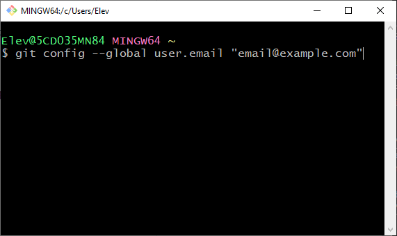

Detta ställer in e-postadressen i Git, och behövs för att kunna synkronisera filer till GitHub. Naturligtvis ska du ange din egen e-postadress.

Därefter skriver du i terminalfönstret:

```
git config --global user.name "Ditt Namn"
```

Även detta behövs för att synkronisera filer med GitHub; naturligtvis anger du ditt eget namn.

Namn och e-postadress kommer inte att synas någonstans utanför datorn, så ovanstående punkter görs enbart för att det ska gå att synkronisera dina filer.

Du kan kontrollera att informationen sparats genom att i terminalfönstret skriva:

```
git config --list
```

***

### __4. Skapa ett SSH-nyckelpar__
Vi går vidare i konfigurationen genom att skapa ett ssh-nyckelpar. `ssh` står för *Secure SHell*, och används ofta för att logga in på datorer på nätverk. `ssh` används även för att autensiera din behörighet att synkronisera filer på ditt eget GitHub-konto.

I terminalfönstret skriver du nu

```
ssh-keygen
```

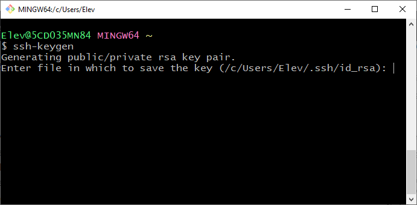
**Tryck \<Enter>**

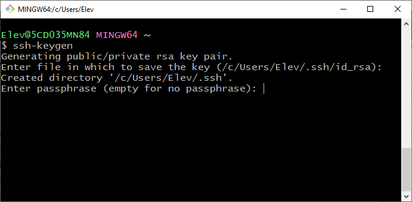

**Tryck \<Enter>** (Du ska alltså inte sätta ett lösenord; detta för att det blir mer lätthanterligt med VS Code).

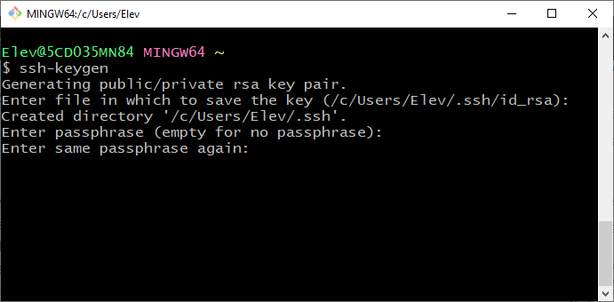

Här ska du bara trycka **\<Enter>** igen.

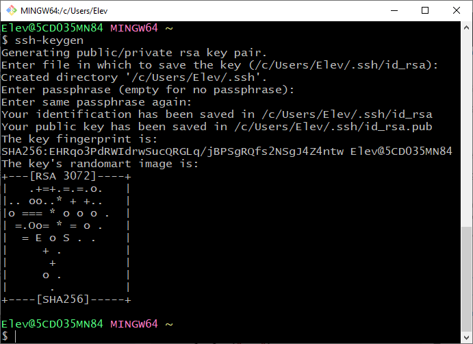

Nu är nyckelparet skapat och terminalen visar lite information om det.

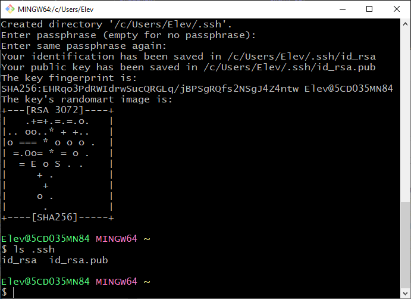

Du kan kontrollera att filerna skapades med kommandot `ls .ssh` i terminalen (observera den inledande punkten).

Filen är nyckelparet; `id_rsa` är den privata delen i paret och ska inte lämna din dator. `id_rsa.pub` är den publika delen och dess innehåll ska kopieras till GitHub (beskrivs i punkt 6 nedan).

Du ska titta på den publika delen av nyckelparet:

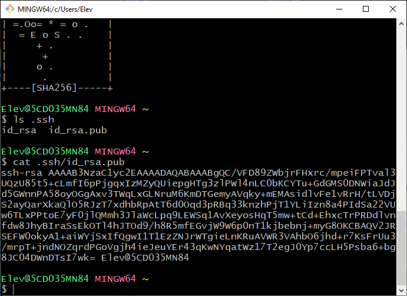

I och med det är själva skapandet av nyckelparet klart (men vi har en bit kvar att gå, så stäng inte terminalfönstret ännu!).

***


### __5. Ge datorn tillåtelse att upprätta förbindelse med GitHub__
Vi måste ge ssh tillåtelse att ansluta till GitHub. Det görs med kommandot

```
ssh-keyscan.exe -t rsa github.com >> .ssh/known_hosts
```

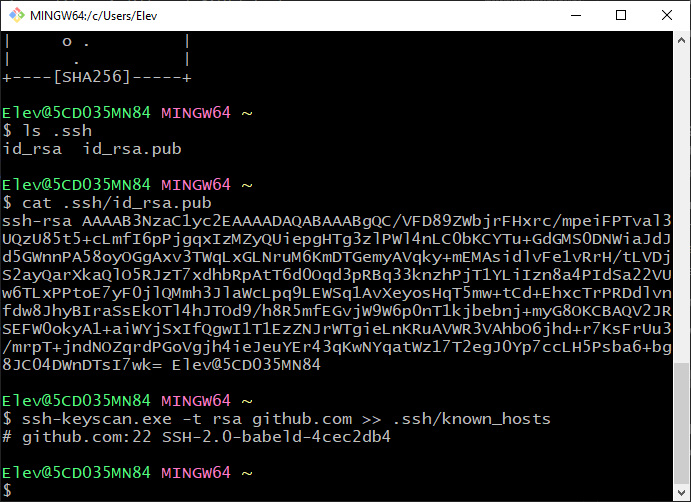

***

### __6. Kopiera den publika delen av nyckelparet__
Nu ska den publika delen av nyckeln kopieras till GitHub. Du har tidigare tittat på innehållet i nyckelparets publika del (om du inte har det kvar i terminalfönstret skriver du `cat .ssh/id_rsa.pub`). Markera det innehållet och kopiera (högerklicka efter du markerat för att få upp menyn med möjlighet att kopiera):

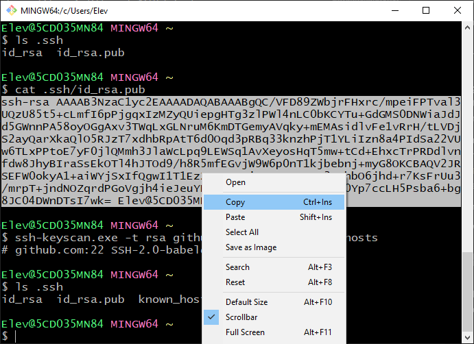

**Tillägg**: Exponera inte din publika nyckel i onödan (och aldrig någonsin din privata nyckel). Själv skapade jag ett nytt nyckelpar efter att jag tagit alla skärmbilder som behövdes.

***

### __7. Installera den publika delen av nyckelparet på GitHub__
Öppna inställningssidan på ditt konto i GitHub:

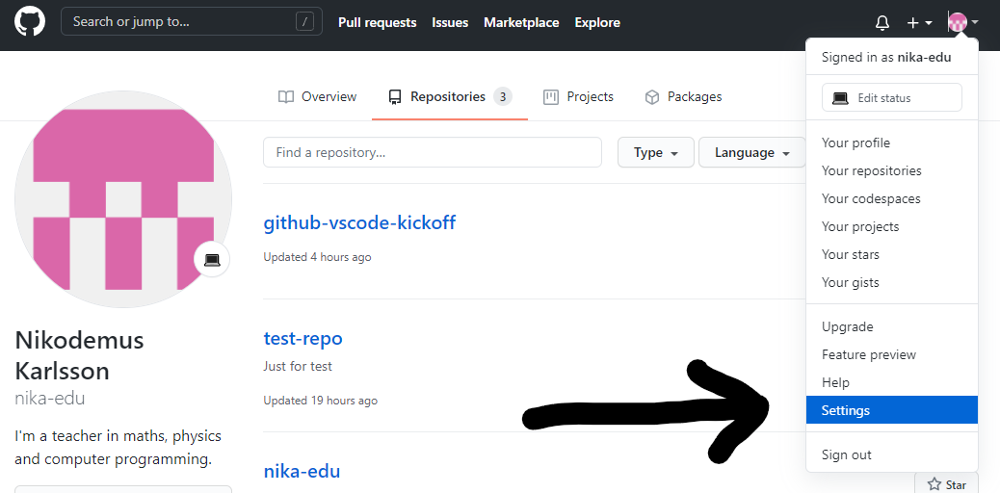

Därefter väljs avdelningen `SSH and GPG keys`, varpå man trycker på knappen `New SSH key`:

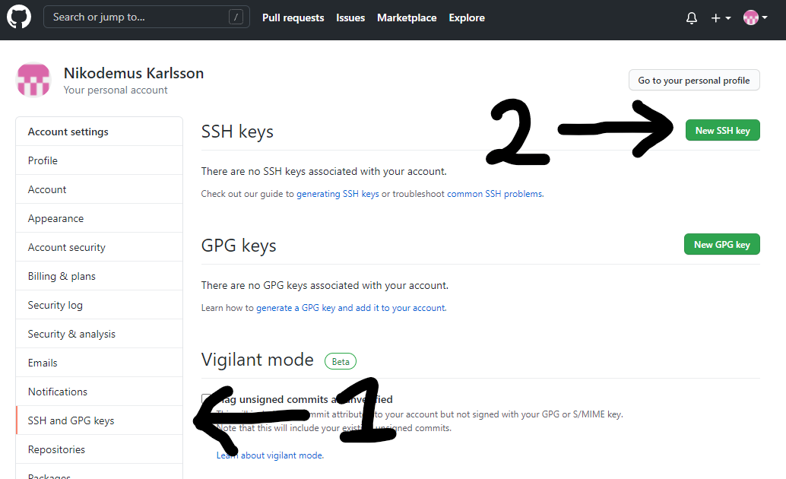

Den publika nyckeln har du kopierat sedan tidigare (punkt 6 ovan), så det bör bara vara att klistra in den. Ge också nyckeln ett namn; själv valde jag det fantasifulla namnet `Default` för min nyckel som jag klistrade in i GitHub.

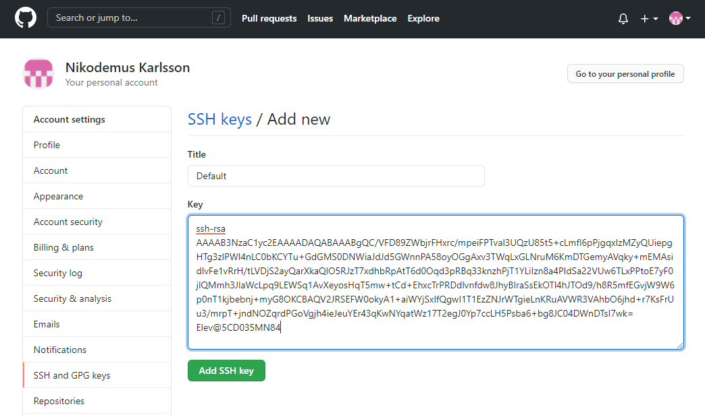

Efter att detta är gjort, och du tryckt på `Add SSH key` under fältet så bör det se ut något liknande som nedan:

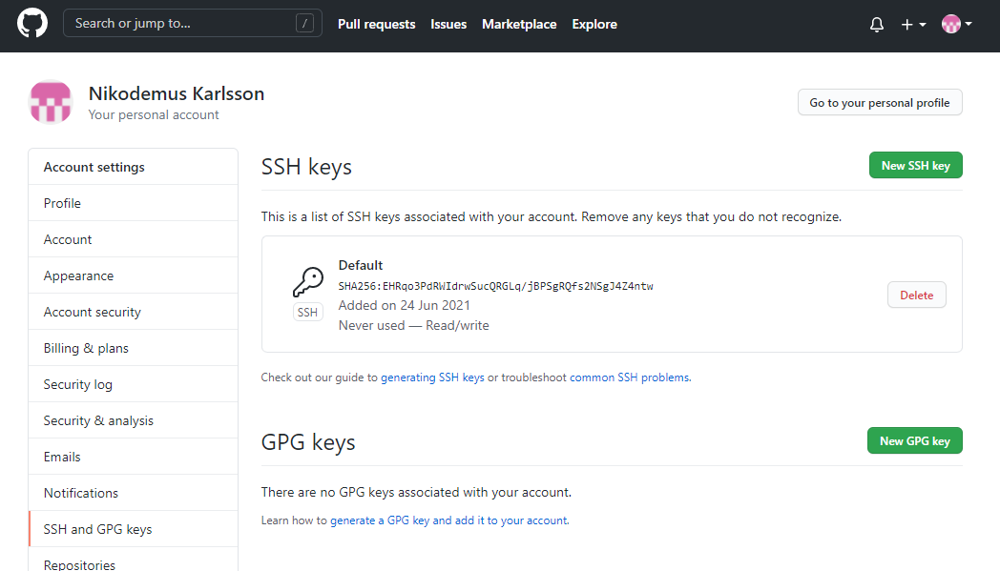

I och med det så är också SSH-konfigurationen av ditt GitHub-konto klar.

***

## Använda VS Code med GitHub
Börja med att [ladda ned](https://code.visualstudio.com/download) och installera VS Code.

VS Code är ett stort program som det dessutom finns massor av tillägg till. Vi fokuserar här på hur det går till att ladda ned ett projekt från GitHub, editera en fil i projektet lokalt på datorn, för att slutligen synkronisera filen med GitHub igen. **Men**: först måste du skapa ett projekt på ditt GitHub-konto. Det vi mest kommer att göra i skolan är att **kopiera** projekt (det kommer egentligen enbart att vara s.k kodskelett och beskrivning av uppgifter), som du sedan ska göra något med. [Jag har skapat projektet CopyMe](https://github.com/nika-edu/CopyMe) som enbart består av en fil.

Efter att du gått till länken till projektet CopyMe så finns det en grön knapp upp till höger som det står `Fork` på. Tryck på den. Det som händer är att en kopia av projektet skapas på ditt GitHub-konto. Går du dit så bör det se ut något i stil med nedanstående bild:

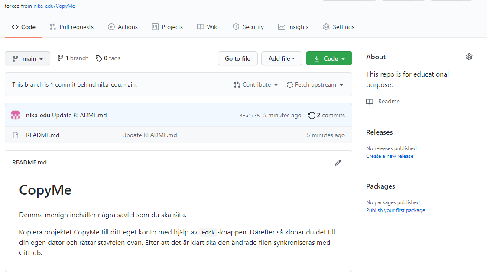

Observera att upptill vänster står det `Forked from nika-edu/CopyMe`, om du ser detta i ditt webbläsarfönster så vet du att du är på rätt plats.

Nu ska projektet klonas till din dator, det görs genom att du trycker på den gröna knappen som det står `Code` på.

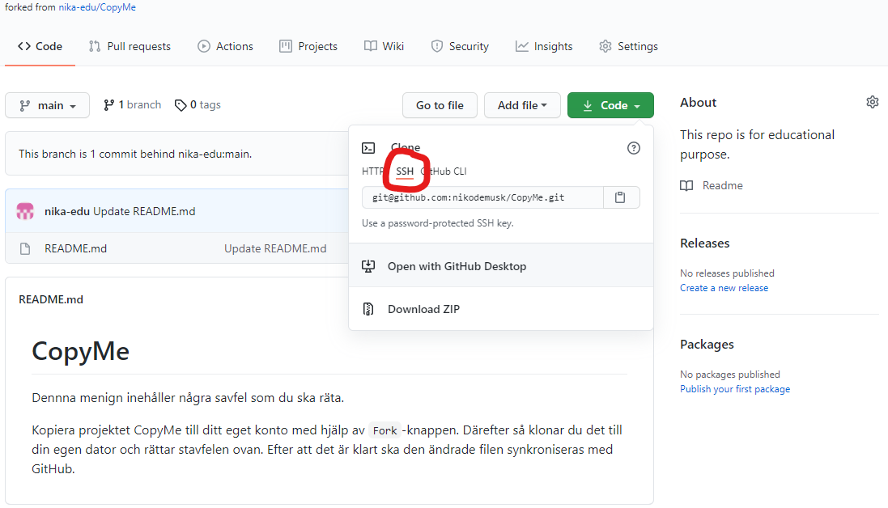

I bilden ovan har jag ringat in att du ska trycka där det står SSH. Det betyder att länken kommer att anpassas till att använda SSH (som du ju konfigurerat sedan tidigare). När SSH är valt ska länken kopieras.